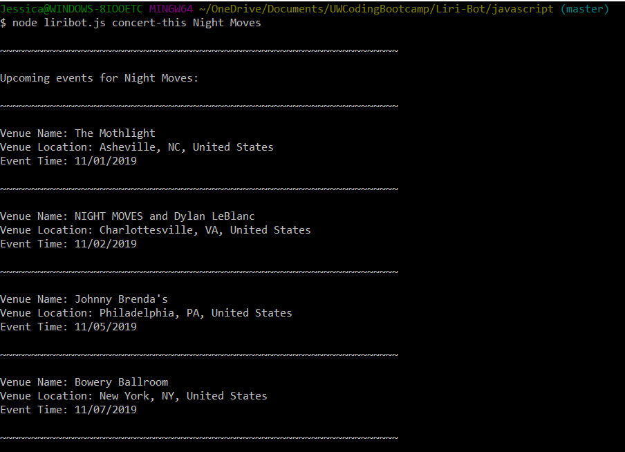
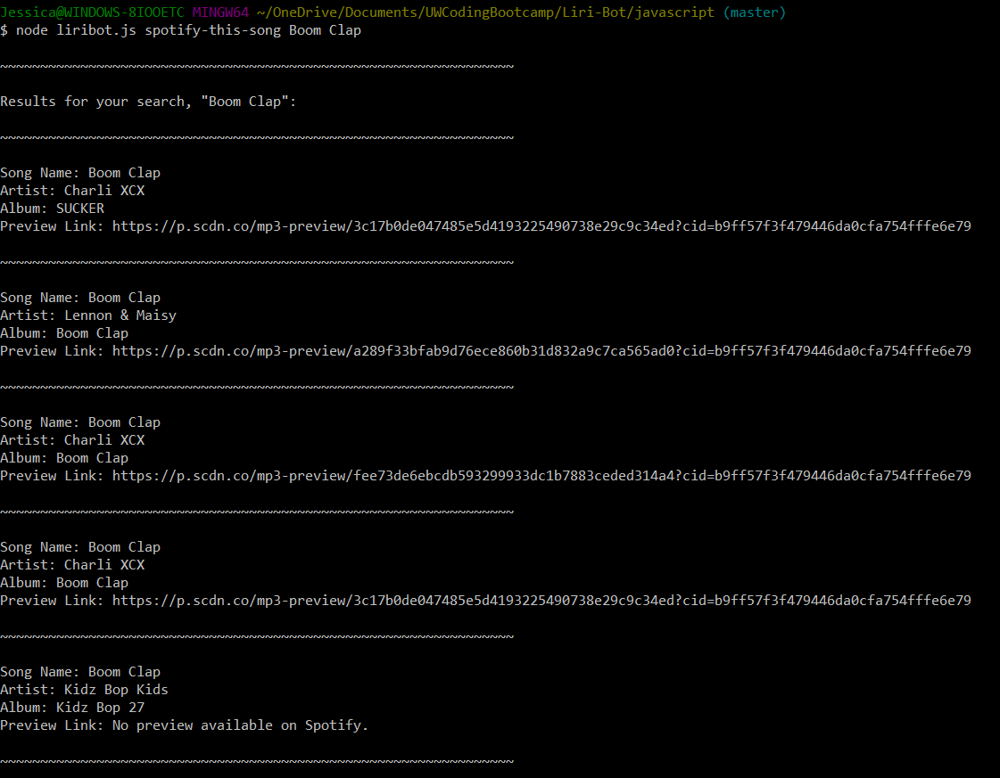
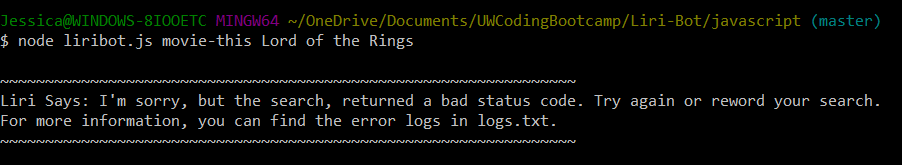
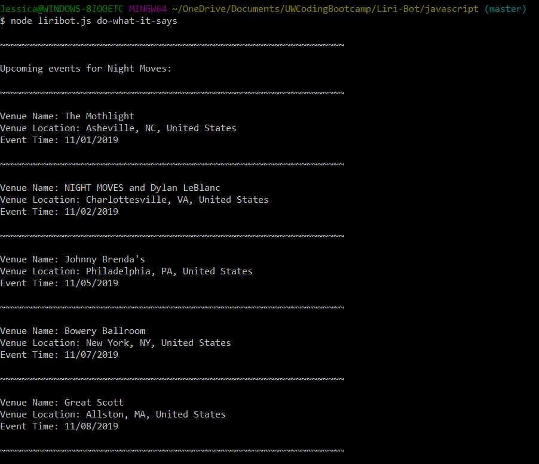
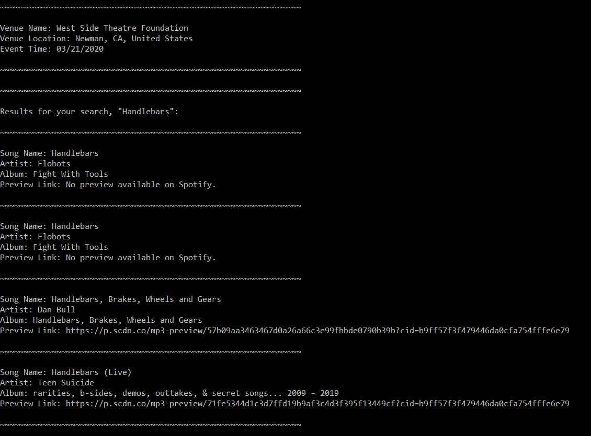
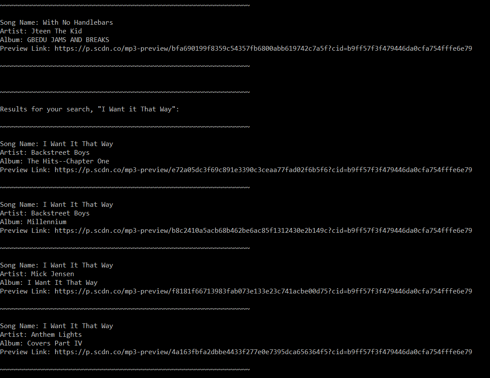
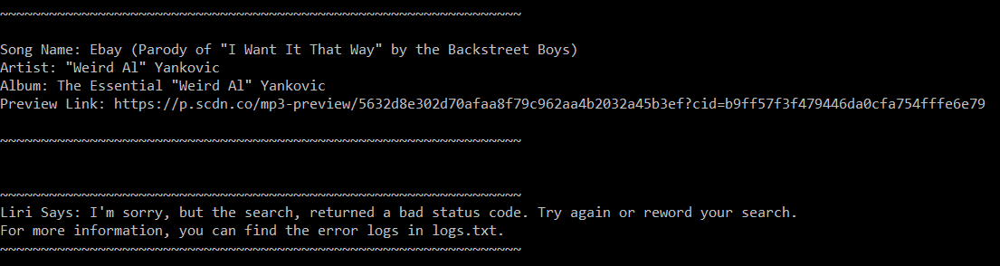

# Liri-Bot
A CLI based personal assistant

### An example of concert-this command

### An example of spotify-this-song command

### An example of movie-this command
At the time of writing this README, the OMDB database was having intermittent issues. So here is a great example of Liri handling errors.

### An example of do-what-it-says command
The text file that Liri read from for this example had the following lines:
- spotify-this-song,"I Want it That Way"
- spotify-this-song,"Handlebars"
- concert-this,"Night Moves"
- movie-this,"Lord of the Rings"

